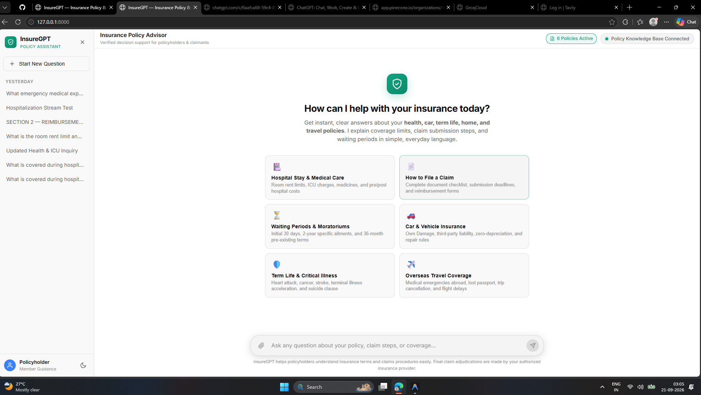
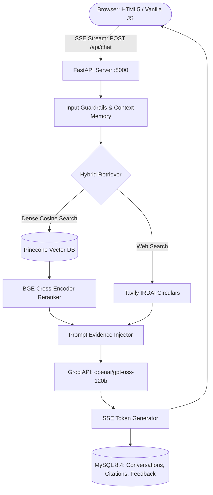

# InsureGPT — Enterprise Insurance AI Assistant

<p align="center">
  
  
  
  
  
  
  
  
</p>

---

## 📸 Application Preview

<p align="center">
  
</p>

> **InsureGPT** is a production-oriented insurance intelligence and decision-support platform. It utilizes **Hybrid RAG**, **Dense Pinecone Vector Search (1536-d)**, **BGE Cross-Encoder Reranking**, and **Groq (`openai/gpt-oss-120b`)** to deliver zero-hallucination, bullet-formatted policy breakdowns with verified source citations.

---

## ⚡ Developer Quickstart

### 1. Local Environment Setup

```bash
# Clone the repository
git clone https://github.com/bittush8789/insuregpt-ai.git
cd insuregpt-ai

# Create and activate virtual environment
python -m venv .venv

# On Windows:
.venv\Scripts\activate
# On Linux/macOS:
source .venv/bin/activate

# Install dependencies
pip install -r requirements.txt
```

### 2. Configure `.env`
Copy `.env.example` to `.env` and fill in credentials:
```bash
cp .env.example .env
```

```ini
HOST=0.0.0.0
PORT=8000
ENVIRONMENT=development

# MySQL Database
MYSQL_HOST=127.0.0.1
MYSQL_PORT=3306
MYSQL_DATABASE=insuregpt
MYSQL_USER=root
MYSQL_PASSWORD=root

# Pinecone
PINECONE_API_KEY=your_pinecone_key
PINECONE_INDEX_NAME=insuregpt-index

# Groq LLM
LLM_PROVIDER=groq
GROQ_API_KEY=gsk_your_groq_api_key
GROQ_MODEL=openai/gpt-oss-120b
OUTPUT_FORMAT=bullet
```

### 3. Start Development Server

```bash
uvicorn app.main:app --host 127.0.0.1 --port 8000 --reload
```

- **Frontend UI**: [http://127.0.0.1:8000](http://127.0.0.1:8000)
- **Interactive Swagger Docs**: [http://127.0.0.1:8000/docs](http://127.0.0.1:8000/docs)
- **Health Endpoint**: [http://127.0.0.1:8000/api/health](http://127.0.0.1:8000/api/health)

---

## 🏗️ System Architecture & High-Level Design (HLD)

> 📘 **Full Architecture Specification**: For complete C4 Model Context, Subsystems, Sequence Diagrams, ER Models, and Technology Trade-Offs, see **[SYSTEM_DESIGN.md](SYSTEM_DESIGN.md)**.



---

## 🛠️ Tech Stack

| Component | Technology | Purpose |
| :--- | :--- | :--- |
| **Backend** | FastAPI, Uvicorn, Pydantic v2 | Async ASGI API server with OpenAPI schemas |
| **LLM Engine** | Groq (`openai/gpt-oss-120b`) | Zero-temperature deterministic bullet generation |
| **Vector DB** | Pinecone Serverless | 1536-dimensional dense cosine index |
| **Reranker** | BGE Cross-Encoder | Top-$K$ semantic chunk reranking |
| **Relational DB** | MySQL 8.4 / SQLAlchemy 2.0 | Chat history, citations, user memories & feedback |
| **Frontend** | HTML5, CSS3, Vanilla ES6+, Marked.js | ChatGPT-style responsive layout with SSE reader |
| **Testing** | Pytest, TestClient | Automated integration & resilience testing |
| **DevOps** | Docker, Docker Compose, KinD (K8s) | Containerized multi-service deployment |

---

## 📁 Repository Structure

```
INSUREGPT/
├── app/
│   ├── main.py                  # FastAPI entrypoint, CORS, static routes
│   ├── config.py                # Pydantic settings management
│   ├── api/
│   │   ├── chat.py              # SSE chat streaming & feedback endpoints
│   │   ├── conversations.py     # Conversation CRUD session endpoints
│   │   └── documents.py         # Policy document upload & listing endpoints
│   ├── rag/
│   │   ├── chunking.py          # Hierarchical clause chunker
│   │   ├── embeddings.py        # Vector embeddings generator
│   │   └── ingestion.py         # Multi-format document parser
│   ├── vectorstore/
│   │   ├── pinecone_client.py   # Pinecone indexing client
│   │   └── retriever.py         # Semantic retrieval & BGE reranker
│   ├── database/
│   │   └── mysql.py             # SQLAlchemy models & schema auto-initializer
│   └── services/
│       ├── llm.py               # Groq LLM integration & bullet-format fallback
│       └── web_search.py        # Tavily web search service
├── frontend/
│   ├── index.html               # Responsive web UI
│   ├── style.css                # Modern CSS with dark/light themes
│   └── app.js                   # Client state, event listeners & SSE parser
├── data/
│   └── documents/               # 6 Pre-seeded insurance policy contracts
├── docs/
│   ├── DEPLOYMENT_EC2.md        # AWS EC2 production deployment guide
│   └── DEPLOYMENT_KIND.md       # Local Kubernetes (KinD) deployment guide
├── k8s/                         # Kubernetes manifests (Namespace, ConfigMap, Secret, MySQL, App)
├── photo/
│   └── image.png                # Application UI screenshot
├── tests/                       # Pytest test suites (test_rag.py, test_web_search.py)
├── Dockerfile                   # Production Python 3.11 container
├── docker-compose.yml           # App + MySQL multi-container setup
├── requirements.txt             # Python dependencies
├── README.md                    # Primary project overview
└── SYSTEM_DESIGN.md             # Detailed High-Level (HLD) & Low-Level (LLD) Design
```

---

## 🐳 Docker Deployment

Run the entire stack (FastAPI Application + MySQL 8.4) with a single command:

```bash
# Build and run containers in background
docker compose up --build -d

# Check running status
docker compose ps

# View live application logs
docker compose logs -f app
```

Application is live at **`http://localhost:8000`**.

---

## ☸️ Kubernetes (KinD) Deployment

Deploy locally using Kubernetes in Docker (KinD) with host port forwarding:

```bash
# 1. Create KinD cluster (mapped to localhost:8000)
kind create cluster --config k8s/kind-config.yaml --name insuregpt-cluster

# 2. Build and load image into KinD
docker build -t insuregpt:latest .
kind load docker-image insuregpt:latest --name insuregpt-cluster

# 3. Apply manifests
kubectl apply -f k8s/

# 4. Check pod status
kubectl get pods -n insuregpt
```

> For complete Kubernetes architecture and troubleshooting, see **[docs/DEPLOYMENT_KIND.md](docs/DEPLOYMENT_KIND.md)**.

---

## ☁️ AWS EC2 Deployment

For production deployment on AWS EC2 (Ubuntu 22.04/24.04 with Docker, Systemd, or Nginx SSL reverse proxy), refer to:
👉 **[docs/DEPLOYMENT_EC2.md](docs/DEPLOYMENT_EC2.md)**

---

## 🔌 API Endpoints Reference

| Method | Endpoint | Description |
| :--- | :--- | :--- |
| `GET` | `/api/health` | Service health status and MySQL database connectivity |
| `POST` | `/api/chat` | Server-Sent Events (SSE) grounded streaming response |
| `POST` | `/api/feedback` | Submit thumbs up (`1`) or thumbs down (`-1`) rating |
| `GET` | `/api/conversations` | List all conversation sessions |
| `POST` | `/api/conversations` | Create a new conversation session |
| `GET` | `/api/conversations/{id}` | Get full conversation messages and source citations |
| `PATCH`| `/api/conversations/{id}` | Update conversation title or metadata |
| `DELETE`| `/api/conversations/{id}`| Delete a conversation and cascade message history |
| `GET` | `/api/documents` | List all indexed policy documents |
| `POST` | `/api/documents/upload` | Upload insurance policy file for vector indexing |

---

## 🧪 Automated Testing

InsureGPT includes automated test suites covering API contracts, MySQL transactions, SSE streaming, and Tavily search resilience.

```bash
# Run complete test suite
python -m pytest -v
```

```
tests\test_rag.py::test_health_check PASSED
tests\test_rag.py::test_conversation_lifecycle PASSED
tests\test_rag.py::test_chat_streaming_endpoint PASSED
tests\test_rag.py::test_feedback_endpoint PASSED
tests\test_web_search.py::test_web_search_service_init PASSED
tests\test_web_search.py::test_web_search_search_with_key PASSED
tests\test_web_search.py::test_web_search_empty_query PASSED
tests\test_web_search.py::test_web_search_error_handling PASSED
tests\test_web_search.py::test_mock_search PASSED

============================= 9 passed in 23.12s ==============================
```

---

## 📄 License

Licensed under the [Apache 2.0 License](LICENSE).
