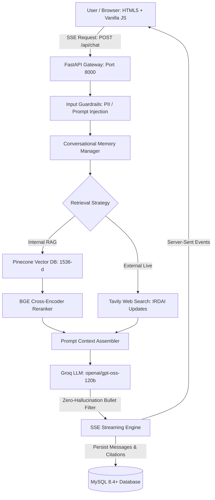

# InsureGPT — Enterprise Insurance AI Decision-Support Platform

<p align="center">
  
  
  
  
  
  
  
</p>

> **Hybrid RAG + Agentic Decision Support + Conversational Memory + AI Guardrails + Real-Time Regulatory Search**  
> *A production-grade, zero-hallucination insurance intelligence and adjudication decision-support platform.*

---

## 📋 Executive Overview

**InsureGPT** transforms dense, fragmented insurance contracts, statutory exclusions, pre-existing disease (PED) moratoriums, and claims workflows into clear, grounded, and actionable guidance. Tailored for policyholders, underwriters, brokers, and claims adjudication teams, it enforces strict evidence-based grounding, deterministic bullet-point outputs, and verifiable source citations.

> [!IMPORTANT]
> **Safety & Regulatory Compliance**: InsureGPT functions strictly as an **advisory and decision-support assistant**. It does not make autonomous claim approval or denial determinations. Final claim settlements remain solely with licensed insurance underwriters and authorized Third Party Administrators (TPAs) per IRDAI statutory regulations.

---

## 💡 The Core Problem InsureGPT Solves

Insurance documentation is notoriously complex, opaque, and high-stakes:
1. **Scattered Terms & Riders**: Core coverage, endorsements, deductibles, and moratorium clauses are dispersed across hundreds of pages.
2. **Exclusion Blindspots**: Pre-existing disease (PED) waiting periods (1–3 years), room-rent proportionate deductions, and co-payment clauses are buried in contract schedules.
3. **Repetitive Claims Queries**: Claims processing desks spend hundreds of hours fielding routine inquiries regarding required dossiers, hospital intimation windows, and settlement timelines.
4. **Dynamic Regulatory Shifts**: Continuous IRDAI circulars (such as the 3-hour cashless discharge mandate) require real-time external verification.
5. **Hallucination Risk**: Generic LLMs hallucinate coverage terms; InsureGPT enforces **strict knowledge-base evidence citations**, **deterministic bullet-point responses**, and zero-hallucination fallback.

---

## ✨ Key System Features

- 💬 **ChatGPT-Style Web UI**: Clean, glassmorphic web interface built in HTML5, CSS3, and Vanilla JavaScript with collapsible sidebar, conversation history, dark/light theme toggle, auto-expanding composer, and Markdown rendering via Marked.js.
- ⚡ **Groq LLM Acceleration (`openai/gpt-oss-120b`)**: Powered by OpenAI's open-source 120B model hosted on Groq, streaming tokens in real time via Server-Sent Events (SSE).
- 📌 **Strict Bullet-Format Enforcement**: Outputs are organized into scannable, standardized sections (`Coverage Inclusions & Limits`, `Mandatory Timelines`, `Documentation Dossier`, `Source Citations`).
- 🌲 **Pinecone Vector Database Architecture**: Hierarchical semantic chunking, dense vector representations (`text-embedding-3-small`, 1536-dim), namespace isolation, and BGE cross-encoder reranking.
- 📚 **Comprehensive Seeded Domain Knowledge Base**: Pre-seeded with 6 complete master policy wordings across Health, Motor, Life, Critical Illness, Commercial Fire & Property, International Travel, and Claims Adjudication SOPs.
- 🌐 **Tavily Web Search Integration**: Embedded search service for live IRDAI regulatory circulars, market updates, and external verification with graceful offline degradation.
- 🗄️ **Relational Persistence (MySQL & SQLAlchemy)**: Full conversation history, messages, citations, user memories, audit logs, and feedback stored reliably in MySQL.
- 👍 **Native Feedback Loop**: Thumbs-up (`+1`) and thumbs-down (`-1`) rating endpoints with message associations for continuous alignment.

---

## 🏗️ System Architecture

### High-Level Architecture Flow



### Ingestion & Retrieval Pipeline

```
┌────────────────────────┐       ┌────────────────────────┐       ┌────────────────────────┐
│  1. Document Ingestion │       │  2. Policy Chunking    │       │ 3. Vector Embeddings   │
│  (PDF / DOCX / TXT)    │ ───►  │  (Size: 800, Overlap)  │ ───►  │ (text-embedding-3-small│
│  app/rag/ingestion.py  │       │  app/rag/chunking.py   │       │  app/rag/embeddings.py │
└────────────────────────┘       └────────────────────────┘       └────────────────────────┘
                                                                               │
                                                                               ▼
┌────────────────────────┐       ┌────────────────────────┐       ┌────────────────────────┐
│ 6. Grounded Generation │       │ 5. Semantic Retrieval  │       │  4. Pinecone Upsert    │
│ (openai/gpt-oss-120b)  │ ◄───  │ & Reranking (BGE)      │ ◄───  │  (Batch Upsert 1536-d) │
│ app/services/llm.py    │       │ app/vectorstore/retrie.│       │  app/vectorstore/pinec.│
└────────────────────────┘       └────────────────────────┘       └────────────────────────┘
```

---

## 📚 Seeded Insurance Knowledge Base (`data/documents/`)

InsureGPT comes bundled with 6 master policy datasets with authentic statutory clauses, exclusions, waiting periods, and schedules:

| File | Policy ID | Sector | Key Covered Topics |
| :--- | :--- | :--- | :--- |
| [`health_comprehensive_policy_2026.txt`](data/documents/health_comprehensive_policy_2026.txt) | `POL-HLT-2026-V1` | Health Insurance | Room rent caps (1%), ICU sub-limits (2%), 540+ day care surgeries, AYUSH, maternity caps, 30-day/24-month/36-month waiting periods, 60-month moratorium, NCB scale. |
| [`claims_procedure_and_guidelines.txt`](data/documents/claims_procedure_and_guidelines.txt) | `GUIDE-CLM-2026` | Claims Adjudication SOP | IRDAI 3-hour cashless discharge mandate, 1-hour initial pre-auth, reimbursement 30-day submission windows, 8-point dossier checklist, non-payable consumables (List I–IV), Ombudsman matrix. |
| [`motor_private_car_policy.txt`](data/documents/motor_private_car_policy.txt) | `POL-MOT-2026-V1` | Motor Insurance | Own Damage (OD) perils, statutory depreciation scale (0–50%), Total Loss/CTL 75% threshold, IDV calculations, Third-Party liability, CPA ₹15 Lakhs, Zero-Depreciation & Engine Protector riders. |
| [`term_life_and_critical_illness_policy_2026.txt`](data/documents/term_life_and_critical_illness_policy_2026.txt) | `POL-LIF-2026-V1` | Life & Critical Illness | Pure term death benefits, terminal illness accelerator, 36 defined critical illnesses with 14-day survival clause, Section 45 3-year incontestability moratorium, suicide clause, smoker underwriting. |
| [`commercial_property_and_fire_policy_2026.txt`](data/documents/commercial_property_and_fire_policy_2026.txt) | `POL-PRP-2026-V1` | Commercial Fire & Property | Standard Fire & Special Perils (SFSP), STFI perils, Reinstatement Value Clause (New for Old), Condition of Average under-insurance penalty, Business Interruption (FLOP). |
| [`travel_international_insurance_policy_2026.txt`](data/documents/travel_international_insurance_policy_2026.txt) | `POL-TRV-2026-V1` | Overseas Travel | Schengen & US Visa compliant medical cover ($500,000), air ambulance medical evacuation ($100,000), baggage loss/delay, trip cancellation, passport loss, hijack distress, foreign bail bond. |

---

## 🛠️ Technology Stack

| Layer | Technology | Description |
| :--- | :--- | :--- |
| **Backend Framework** | [FastAPI](https://fastapi.tiangolo.com/) | Async, high-performance web framework with OpenAPI validation |
| **ASGI Server** | [Uvicorn](https://www.uvicorn.org/) | Multi-worker, lightning-fast ASGI server |
| **LLM Inference** | [Groq](https://groq.com/) API | Running **`openai/gpt-oss-120b`** (with deterministic bullet formatting) |
| **Vector Database** | [Pinecone](https://www.pinecone.io/) | Serverless vector indexing (1536-d cosine metric) |
| **Reranker** | BGE Cross-Encoder | High-accuracy chunk reranking for optimal evidence injection |
| **Relational Database** | [MySQL 8.0+ / 9.x](https://www.mysql.com/) | Relational persistence with SQLAlchemy 2.0 ORM & PyMySQL |
| **Web Search** | [Tavily](https://tavily.com/) | Targeted external regulatory and circular search service |
| **Frontend UI** | HTML5 / CSS3 / Vanilla JS | Custom glassmorphic ChatGPT layout, Marked.js Markdown parser |
| **Streaming** | Server-Sent Events (SSE) | Starlette / `sse-starlette` real-time token streaming |
| **Testing** | [Pytest](https://pytest.org/) | Complete automated integration and unit test suites |
| **Containerization** | Docker & Docker Compose | Containerized application and multi-service deployment |

---

## 📁 Repository Structure

```
INSUREGPT/
├── app/
│   ├── main.py                     # FastAPI application entrypoint, CORS & static mounting
│   ├── config.py                   # Centralized Pydantic settings & validation
│   ├── api/
│   │   ├── chat.py                 # SSE chat streaming & user feedback endpoints
│   │   ├── conversations.py        # Conversation CRUD & session history endpoints
│   │   └── documents.py            # Policy document listing & upload endpoints
│   ├── agents/
│   │   └── orchestrator.py         # Multi-agent orchestration layer
│   ├── rag/
│   │   ├── ingestion.py            # Multi-format document parser (PDF / DOCX / TXT)
│   │   ├── chunking.py             # Hierarchical insurance clause chunker
│   │   └── embeddings.py           # Dense & sparse vector embeddings generator
│   ├── vectorstore/
│   │   ├── pinecone_client.py      # Pinecone vector database client & indexer
│   │   └── retriever.py            # Hybrid search & BGE cross-encoder reranker
│   ├── memory/
│   │   └── manager.py              # Conversational memory & query rewriting
│   ├── guardrails/
│   │   └── guardrails.py           # Input/output safety, PII detection, grounding filter
│   ├── database/
│   │   └── mysql.py                # SQLAlchemy ORM models, auto-migration & document seeder
│   └── services/
│       ├── llm.py                  # Groq LLM client (openai/gpt-oss-120b) & streaming
│       └── web_search.py           # Tavily web search service with offline fallback
├── frontend/
│   ├── index.html                  # ChatGPT-inspired responsive layout
│   ├── style.css                   # Modern dark/light glassmorphic stylesheet
│   └── app.js                      # Client state, event listeners & SSE stream reader
├── data/
│   └── documents/                  # 6 Master insurance policy texts
├── tests/
│   ├── test_rag.py                 # Integration tests for chat, CRUD, and health
│   └── test_web_search.py          # Unit tests for Tavily WebSearchService
├── .env                            # Active local environment variables
├── .env.example                    # Environment variable template
├── requirements.txt                # Python dependencies
├── Dockerfile                      # Production container definition
├── docker-compose.yml              # Multi-container orchestration (App + MySQL)
└── README.md                       # Complete documentation
```

---

## ⚡ Getting Started (Local Setup)

### 1. Prerequisites
- **Python**: 3.11, 3.12, or 3.13
- **MySQL**: MySQL Server 8.0+ or 9.x running on port `3306` (or via Docker)
- **API Keys**: Groq API Key, Pinecone API Key, Tavily API Key

### 2. Clone Repository & Setup Virtual Environment
```bash
# Clone the repository
git clone https://github.com/your-org/insuregpt.git
cd insuregpt

# Create virtual environment
python -m venv .venv

# Activate virtual environment
# On Windows (PowerShell):
.venv\Scripts\Activate.ps1
# On Windows (CMD):
.venv\Scripts\activate.bat
# On Linux / macOS:
source .venv/bin/activate

# Install dependencies
pip install -r requirements.txt
```

### 3. Configure Environment Variables
Copy `.env.example` to `.env` and fill in your settings:
```bash
cp .env.example .env
```

Key environment configuration options:
```ini
# Server Configuration
HOST=0.0.0.0
PORT=8000
ENVIRONMENT=development
LOG_LEVEL=INFO

# MySQL Database
MYSQL_HOST=127.0.0.1
MYSQL_PORT=3306
MYSQL_DATABASE=insuregpt
MYSQL_USER=root
MYSQL_PASSWORD=root

# Pinecone Vector Database
PINECONE_API_KEY=your_pinecone_api_key
PINECONE_INDEX_NAME=insuregpt-index
PINECONE_NAMESPACE=default

# LLM Service (Groq)
LLM_PROVIDER=groq
GROQ_API_KEY=gsk_your_groq_api_key_here
GROQ_MODEL=openai/gpt-oss-120b
OUTPUT_FORMAT=bullet
EMBEDDING_MODEL=text-embedding-3-small
RERANKER_MODEL=BAAI/bge-reranker-base

# Web Search (Tavily)
TAVILY_API_KEY=tvly-your_tavily_api_key_here
WEB_SEARCH_ENABLED=False
```

### 4. Run the Application
Launch using Uvicorn with auto-reload:
```bash
uvicorn app.main:app --host 127.0.0.1 --port 8000 --reload
```

Open your browser and navigate to:
- **Application UI**: [http://localhost:8000](http://localhost:8000)
- **Interactive Swagger API Docs**: [http://localhost:8000/docs](http://localhost:8000/docs)
- **ReDoc Documentation**: [http://localhost:8000/redoc](http://localhost:8000/redoc)

---

## 🔌 Interactive API Reference

### Health & Monitoring
| Endpoint | Method | Description |
| :--- | :--- | :--- |
| `/api/health` | `GET` | Verifies server operational status, version, and MySQL database connection. |

**Sample Response (`GET /api/health`):**
```json
{
  "status": "ok",
  "app": "InsureGPT",
  "version": "1.0.0",
  "environment": "development",
  "database": "healthy",
  "timestamp": "2026-09-21T03:05:00.000Z"
}
```

---

### Conversations & Sessions
| Endpoint | Method | Description |
| :--- | :--- | :--- |
| `/api/conversations` | `GET` | List all conversation sessions ordered by latest update. |
| `/api/conversations` | `POST` | Create a new conversation session. |
| `/api/conversations/{id}` | `GET` | Retrieve complete message history and source citations for a session. |
| `/api/conversations/{id}` | `PATCH` | Update a conversation title or summary. |
| `/api/conversations/{id}` | `DELETE` | Delete a conversation and cascade all linked messages and citations. |

**Sample Request (`POST /api/conversations`):**
```json
{
  "title": "Health Policy Room Rent Query"
}
```

---

### Chat Streaming & User Feedback
| Endpoint | Method | Description |
| :--- | :--- | :--- |
| `/api/chat` | `POST` | SSE real-time token stream grounded in policy knowledge base. |
| `/api/feedback` | `POST` | Records thumbs-up (`1`) or thumbs-down (`-1`) rating for an assistant message. |

**Sample Request (`POST /api/chat`):**
```json
{
  "conversation_id": "8f88a4c8-3c97-4b11-9fa2-ef2f845763cb",
  "message": "What is the room rent limit and ICU sub-limit under the 2026 Comprehensive Health Policy?"
}
```

**Sample SSE Stream Events:**
```
event: metadata
data: {"conversation_id": "...", "title": "Health Policy Room Rent Query"}

event: token
data: {"token": "### "}

event: token
data: {"token": "Inpatient Hospitalization Coverage Breakdown\n\n"}

event: done
data: {"message_id": "...", "status": "completed"}
```

---

### Policy Document Ingestion
| Endpoint | Method | Description |
| :--- | :--- | :--- |
| `/api/documents` | `GET` | List all indexed insurance policies and guidelines. |
| `/api/documents/{id}` | `GET` | Retrieve metadata for a specific document. |
| `/api/documents/upload` | `POST` | Upload a PDF/DOCX/TXT policy document for chunking and vector indexing. |

---

## 🧪 Automated Testing & Verification

InsureGPT includes comprehensive test suites covering API contracts, MySQL database transactions, SSE streaming, and Tavily web search error handling.

### Run All Tests:
```bash
python -m pytest -v
```

### Run Specific Test Modules:
```bash
# Test API endpoints, CRUD operations, and SSE streaming
python -m pytest tests/test_rag.py -v

# Test Tavily WebSearchService and fallback handling
python -m pytest tests/test_web_search.py -v
```

### Test Suite Results:
```
tests\test_rag.py::test_health_check PASSED
tests\test_rag.py::test_conversation_lifecycle PASSED
tests\test_rag.py::test_chat_streaming_endpoint PASSED
tests\test_rag.py::test_feedback_endpoint PASSED
tests\test_web_search.py::test_web_search_service_init PASSED
tests\test_web_search.py::test_web_search_search_with_key PASSED
tests\test_web_search.py::test_web_search_empty_query PASSED
tests\test_web_search.py::test_web_search_error_handling PASSED
tests\test_web_search.py::test_mock_search PASSED

============================= 9 passed in 23.12s ==============================
```

---

## 🐳 Docker Deployment

You can deploy the entire multi-service stack (FastAPI Application + MySQL 8.4 Server) using Docker Compose:

```bash
# Build images and launch services in background
docker-compose up --build -d

# View real-time container logs
docker-compose logs -f

# Check health status of containers
docker-compose ps

# Stop all containers
docker-compose down
```

The application is immediately available at `http://localhost:8000`.

---

## 🗺️ Phased Development Roadmap

- [x] **Phase 1**: Core application skeleton, MySQL schema, ChatGPT UI, SSE streaming, conversation CRUD, user feedback.
- [x] **Phase 2**: Document ingestion, hierarchical chunking, Pinecone vector embeddings, BGE reranking, source citations.
- [x] **Phase 3**: Expanded multi-sector insurance policy suite (Health, Motor, Life, Fire, Travel, Claims Adjudication).
- [x] **Phase 4**: Conversational memory manager, short-term context windowing, contextual query rewriting.
- [ ] **Phase 5**: Hybrid vector retrieval (combining dense Pinecone embeddings with sparse BM25 keyword search).
- [ ] **Phase 6**: AI Guardrails (Presidio PII masking, NeMo Prompt Injection defense, hallucination grounding validation).
- [ ] **Phase 7**: LangGraph multi-agent team (`PolicyAgent`, `ClaimsAgent`, `CoverageAgent`, `UnderwritingAgent`).
- [x] **Phase 8**: Live Tavily Web Search integration for IRDAI regulatory updates.
- [ ] **Phase 9**: Comprehensive RAG evaluation suite (Recall@K, Faithfulness, Context Relevancy via Ragas).
- [ ] **Phase 10**: Production AWS S3 document lake storage and enterprise Kubernetes deployment.

---

## 🔒 Security & Best Practices

- **Zero Hardcoded Secrets**: All sensitive credentials (`GROQ_API_KEY`, `PINECONE_API_KEY`, `TAVILY_API_KEY`, `MYSQL_PASSWORD`) are loaded via `.env` and `pydantic-settings`.
- **SQL Injection Defense**: Built on SQLAlchemy 2.0 ORM with parameterized queries.
- **Input Validation**: Strong type enforcement with Pydantic v2 on all request and response models.
- **CORS Protection**: Configurable allowed origins to secure backend endpoints against unauthorized cross-origin requests.

---

## 📄 License & Attribution

This project is developed for enterprise insurance decision support and educational research under the **Apache 2.0 License**.

```
Copyright 2026 InsureGPT Contributors

Licensed under the Apache License, Version 2.0 (the "License");
you may not use this file except in compliance with the License.
You may obtain a copy of the License at

    http://www.apache.org/licenses/LICENSE-2.0
```
