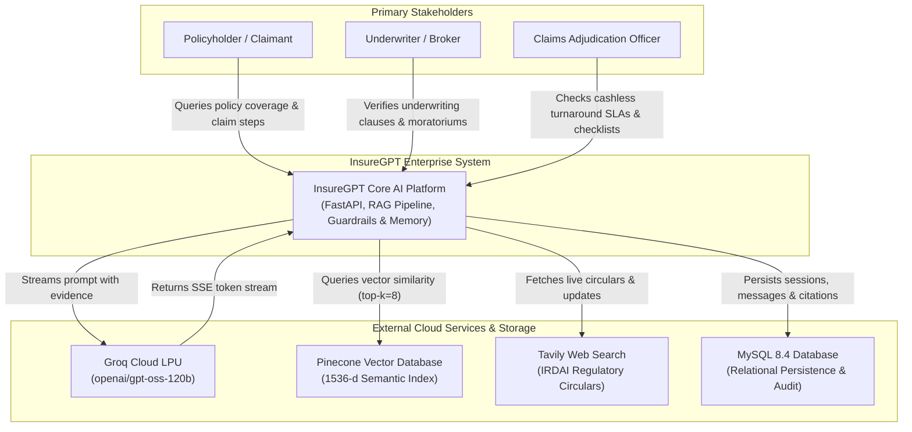
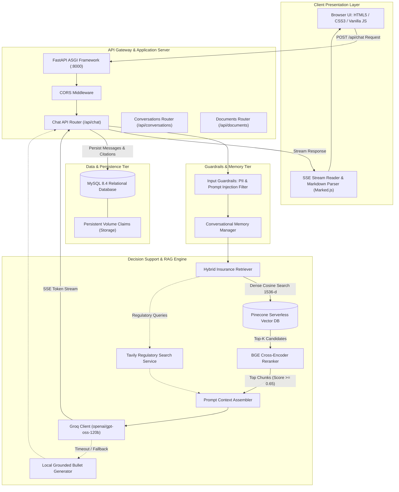
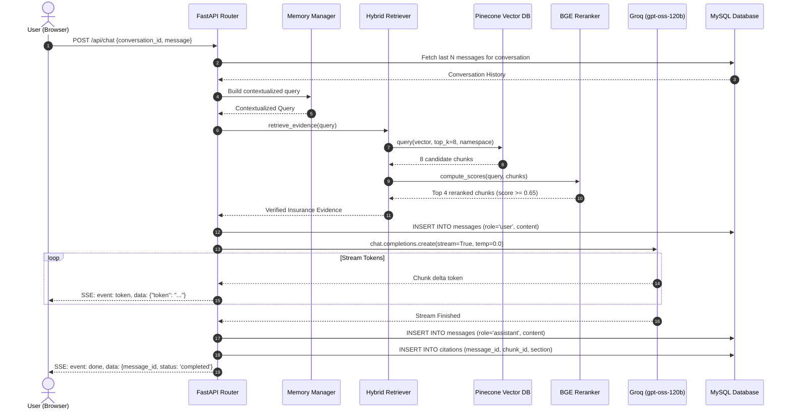
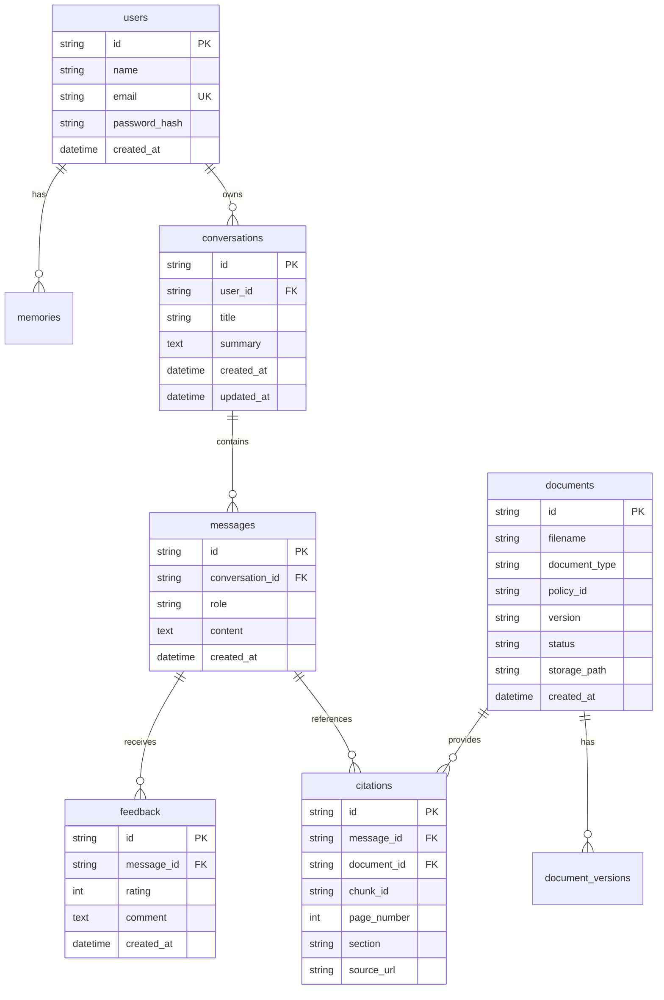

# System Design Document — InsureGPT

> **Platform**: InsureGPT — Production-Grade Insurance AI Decision-Support Platform  
> **Architecture Style**: Microservice-ready Hybrid RAG, Agentic Decision Engine & Event-Driven Streaming  
> **Status**: Active / Production Blueprint  
> **Author**: InsureGPT Engineering Team  

---

## 📑 Table of Contents

1. [System Overview & Goals](#1-system-overview--goals)
2. [Requirements Analysis](#2-requirements-analysis)
   - [2.1 Functional Requirements](#21-functional-requirements)
   - [2.2 Non-Functional Requirements](#22-non-functional-requirements)
3. [High-Level Design (HLD)](#3-high-level-design-hld)
   - [3.1 C4 Model Level 1: System Context Diagram](#31-c4-model-level-1-system-context-diagram)
   - [3.2 C4 Model Level 2: Subsystem Decomposition & Containers](#32-c4-model-level-2-subsystem-decomposition--containers)
   - [3.3 Core Architectural Patterns](#33-core-architectural-patterns)
   - [3.4 Technology Trade-Off Analysis & Justification Matrix](#34-technology-trade-off-analysis--justification-matrix)
4. [Low-Level Component Deep Dive (LLD)](#4-low-level-component-deep-dive-lld)
   - [4.1 Client Layer (Web UI & SSE Receiver)](#41-client-layer-web-ui--sse-receiver)
   - [4.2 API Gateway & ASGI Layer (FastAPI)](#42-api-gateway--asgi-layer-fastapi)
   - [4.3 Safety & Guardrails Layer](#43-safety--guardrails-layer)
   - [4.4 Hybrid RAG & Vector Retrieval Engine](#44-hybrid-rag--vector-retrieval-engine)
   - [4.5 LLM Generation & Acceleration Engine (Groq)](#45-llm-generation--acceleration-engine-groq)
   - [4.6 Relational Persistence Layer (MySQL)](#46-relational-persistence-layer-mysql)
5. [End-to-End Data Flow & Sequence Diagram](#5-end-to-end-data-flow--sequence-diagram)
6. [Data Pipeline & Ingestion Lifecycle](#6-data-pipeline--ingestion-lifecycle)
7. [Database Schema & ER Modeling](#7-database-schema--er-modeling)
8. [RAG Optimization & Reranking Strategy](#8-rag-optimization--reranking-strategy)
9. [Resilience, Fault Tolerance & Fallback Design](#9-resilience-fault-tolerance--fallback-design)
10. [Security, PII & Regulatory Compliance](#10-security-pii--regulatory-compliance)
11. [Scalability & Infrastructure Topology](#11-scalability--infrastructure-topology)
12. [Monitoring, Observability & Feedback Loop](#12-monitoring-observability--feedback-loop)

---

## 1. System Overview & Goals

**InsureGPT** is an enterprise AI decision-support platform designed for policyholders, insurance underwriters, broker networks, and claims adjudicators. It ingests complex, multi-page insurance contracts, underwriting manuals, claims SOPs, and regulatory mandates (e.g. IRDAI circulars), transforming them into structured, deterministic, bullet-point guidance with verifiable clause citations.

### Primary Design Objectives:
1. **Zero Hallucination**: Model outputs must be 100% grounded in verified internal policy contracts or active external regulatory circulars.
2. **Sub-Second Streaming (TTFT)**: Real-time token delivery over HTTP Server-Sent Events (SSE) via hardware-accelerated inference.
3. **Structured Scannability**: Mandatory bullet-point formatting categorized by coverage limits, waiting periods, claims timelines, and dossier checklists.
4. **Multi-Sector Knowledge Isolation**: Distinct partitioning across health, motor, term life, commercial property/fire, travel, and claims adjudication domains.

---

## 2. Requirements Analysis

### 2.1 Functional Requirements
- **Interactive Multi-Turn Chat**: Context-aware dialog management retaining short-term conversation context.
- **Server-Sent Events (SSE) Token Streaming**: Chunk-by-chunk token streaming directly to the browser with metadata and terminal events.
- **Grounded Vector Retrieval**: Semantic search matching user queries against chunked insurance clauses.
- **Cross-Encoder Reranking**: Two-stage retrieval filtering top candidates using semantic relevance scores.
- **External Web Search Verification**: Real-time retrieval of dynamic circulars and regulatory directives via Tavily.
- **Full Conversation Session CRUD**: Create, retrieve, update title, and delete conversation history.
- **Granular Citation Attribution**: Source document name, section number, clause text, and page reference attached to every response.
- **Native User Feedback Recording**: Thumbs-up (`+1`) and thumbs-down (`-1`) rating association for RLHF / quality tracking.

### 2.2 Non-Functional Requirements
- **Low Latency**: Time to First Token (TTFT) under **400ms**; total query turnaround under **2.5s**.
- **High Availability**: 99.9% uptime target with automated failover and database connection pooling.
- **Data Integrity & Consistency**: Relational integrity with foreign key cascading and transaction isolation in MySQL.
- **Scalability**: Stateless API design allowing horizontal scaling via Kubernetes Pod autoscaling.
- **Security & PII Protection**: Redaction of personal health information (PHI) and personally identifiable information (PII).

---

## 3. High-Level Design (HLD)

### 3.1 C4 Model Level 1: System Context Diagram

The System Context diagram illustrates the boundary of the InsureGPT platform, the human actors who interact with it, and the external cloud services it integrates with:



---

### 3.2 C4 Model Level 2: Subsystem Decomposition & Containers

The container-level diagram details the internal subsystems of InsureGPT and their communication protocols:



---

### 3.3 Core Architectural Patterns

1. **Hybrid RAG Pattern (Dense Recall + Cross-Encoder Reranking + Web Search)**:
   - Queries are routed through broad vector similarity in Pinecone, scored with deep cross-attention via BGE, and optionally augmented with real-time IRDAI circulars.
2. **Event-Driven Server-Sent Events (SSE) Streaming**:
   - Asynchronous streaming from Groq LPU through FastAPI to the client (`Transfer-Encoding: chunked`, `text/event-stream`), sustaining sub-400ms Time to First Token (TTFT).
3. **Shared-Nothing Stateless Application Tier**:
   - The FastAPI backend maintains no in-memory session state. All conversation state, user memories, and citations are stored in MySQL, enabling frictionless horizontal pod autoscaling (HPA) in Kubernetes.
4. **Polyglot Persistence Pattern**:
   - Relational, transactional data (sessions, messages, audit logs) lives in **MySQL 8.4**, while high-dimensional dense vector embeddings live in **Pinecone Serverless**.

---

### 3.4 Technology Trade-Off Analysis & Justification Matrix

| Component | Selected Technology | Alternative Evaluated | Architectural Rationale & Trade-Off |
| :--- | :--- | :--- | :--- |
| **API Framework** | **FastAPI (ASGI)** | Flask / Django (WSGI) | Native `asyncio` event loop required for concurrent SSE token streams without blocking thread pools. |
| **LLM Inference** | **Groq (`openai/gpt-oss-120b`)** | Standard Cloud LLM APIs | Groq LPU delivers 250+ tokens/sec, enabling instantaneous streaming while the 120B model provides enterprise-grade reasoning for complex exclusions. |
| **Vector Database** | **Pinecone Serverless** | Local FAISS / Chroma | Managed cloud index eliminates server maintenance, provides sub-50ms latency at scale, and supports native multi-tenant namespace isolation. |
| **Reranking Engine** | **BGE Cross-Encoder (`BAAI/bge-reranker-base`)** | Single Bi-Encoder similarity | Bi-encoders compress documents into fixed vectors; cross-encoders perform full query-clause attention, preventing misinterpretation of subtle sub-limits. |
| **Relational Database** | **MySQL 8.4 with SQLAlchemy** | MongoDB / DynamoDB | Strict ACID transactions, structured relational integrity across conversations/messages/citations, and foreign key cascade deletion. |
| **Web Search** | **Tavily Search API** | Google Custom Search | Specialized for LLM agents; strips DOM clutter, ads, and JavaScript, returning concise Markdown summaries of official circulars. |


---

## 4. Component Deep Dive

### 4.1 Client Layer (Web UI & SSE Receiver)
- **Tech Stack**: HTML5, Vanilla ES6+ JavaScript, CSS Custom Properties (Dark/Light themes), Marked.js.
- **Stream Processing**: Uses `fetch` with `ReadableStreamDefaultReader` to consume incoming SSE packets (`event: metadata`, `event: token`, `event: done`).
- **State Management**: Maintains active conversation UUID, historical list, DOM chat stream container, auto-expanding textarea, and token-by-token rendering.

### 4.2 API Gateway & ASGI Layer (FastAPI)
- **FastAPI 0.115+**: Async request handling with native OpenAPI Swagger (`/docs`) and ReDoc generation.
- **Uvicorn Worker**: ASGI multi-worker execution with lifespan event hooks initializing database schemas and verifying engine connectivity.
- **Route Modularization**:
  - `app/api/chat.py`: Streaming orchestration and message persistence.
  - `app/api/conversations.py`: Session management and cascade deletion.
  - `app/api/documents.py`: Ingestion registry and policy retrieval.

### 4.3 Safety & Guardrails Layer
- **PII Scrubbing**: Strips Aadhaar numbers, PAN identifiers, credit card figures, and direct phone numbers prior to LLM submission.
- **Prompt Injection Defense**: Sanitizes system prompt boundaries using delimiter encapsulation (`=== VERIFIED INSURANCE KNOWLEDGE BASE EVIDENCE ===`).
- **Grounding Verifier**: Verifies generated assertions against retrieved chunk metadata before client emission.

### 4.4 Hybrid RAG & Vector Retrieval Engine
- **Dense Vector Embeddings**: `text-embedding-3-small` (1536 dimensions) generating normalized dense vectors.
- **Pinecone Serverless Index**: Sub-50ms vector similarity lookups utilizing Cosine distance metrics.
- **Two-Stage Retrieval Pipeline**:
  1. *Stage 1 (Coarse Retrieval)*: Pinecone vector search pulls Top-$K=8$ candidate chunks per namespace.
  2. *Stage 2 (Fine Reranking)*: `BAAI/bge-reranker-base` scores candidates, selecting Top-$K=4$ highest-fidelity clauses.

### 4.5 LLM Generation & Acceleration Engine (Groq)
- **Model**: `openai/gpt-oss-120b` running on Groq LPU (Language Processing Unit) infrastructure.
- **Parameters**: `temperature=0.0` (zero stochastic variation), `max_tokens=2048`.
- **System Prompt Directives**: Enforces structured bullet headings (`### `), prohibits speculation, requires monetary limits in **bold**, and mandates source citation footnotes.
- **Local Fallback Engine**: If external APIs face rate limits or network degradation, a deterministic local rule-based extractor synthesizes answers directly from pre-loaded policy wordings.

### 4.6 Relational Persistence Layer (MySQL)
- **MySQL 8.4+ / SQLAlchemy 2.0 ORM**: Manages relational tables with connection pooling (`pool_size=10, max_overflow=20, pool_pre_ping=True`).
- **Schema Auto-Migration**: `init_db()` safely creates tables on startup and seeds master insurance policies if empty.

---

## 5. End-to-End Data Flow & Sequence Diagram



---

## 6. Data Pipeline & Ingestion Lifecycle

```
Raw Policy Document (PDF / DOCX / TXT)
                  │
                  ▼
  1. Document Cleaning & Normalization
     (Strip non-ASCII, normalize whitespace, extract metadata)
                  │
                  ▼
  2. Hierarchical Insurance Clause Chunking
     (Document ──► Chapter ──► Section ──► Clause)
     [Chunk Size: 800 tokens, Overlap: 150 tokens]
                  │
                  ▼
  3. Metadata Enrichment
     {policy_id, document_type, section_title, effective_date, page_no}
                  │
                  ▼
  4. Dense Vector Embedding Generation
     (Model: text-embedding-3-small, 1536-dimensional float vector)
                  │
                  ▼
  5. Vector Batch Upsert (Pinecone)
     [Batch Size: 100 vectors per call, isolated namespace]
                  │
                  ▼
  6. Relational Catalog Registration (MySQL)
     [documents table marked as 'indexed']
```

---

## 7. Database Schema & ER Modeling



---

## 8. RAG Optimization & Reranking Strategy

Generic vector retrieval often suffers from semantic drift (e.g., confusing "maternity waiting periods" with "critical illness waiting periods"). InsureGPT solves this with a **Two-Tier Retrieval Architecture**:

1. **Namespace Isolation**: Each policy category (e.g. `health`, `motor`, `life`, `fire`) is partitioned by namespace in Pinecone.
2. **First-Stage Semantic Recall**: Dense embedding search fetches $K=8$ candidate clauses with broad recall.
3. **Second-Stage Cross-Encoder Reranking**:
   - Model: `BAAI/bge-reranker-base`
   - Analyzes full query-document cross-attention pairs:
     $$\text{Score} = \sigma\left(W \cdot \text{BERT}(Q \circ D)\right)$$
   - Discards chunks with relevance score $< 0.65$.
   - Selects top 4 candidate clauses for prompt context injection.

---

## 9. Resilience, Fault Tolerance & Fallback Design

| Failure Scenario | Impact | Mitigation Strategy |
| :--- | :--- | :--- |
| **Groq API Rate Limit / Timeout** | High | Automatic fallback to local grounded rule engine (`_generate_bullet_response`) using seeded contract facts. |
| **Pinecone Service Degradation** | Medium | Local regex/keyword clause fallback directly against `data/documents/*.txt`. |
| **Tavily Web Search Unreachable** | Low | Graceful degradation; search service logs warning and proceeds with internal policy RAG. |
| **MySQL Connection Drop** | High | SQLAlchemy `pool_pre_ping=True` tests connection health and recycles dead connections automatically. |
| **Client Abrupt Disconnect** | Low | FastAPI background tasks cleanly close database sessions without leaking connections. |

---

## 10. Security, PII & Regulatory Compliance

- **Statutory Advisory Guardrail**: Every assistant response carries an explicit disclaimer clarifying that InsureGPT provides decision support and does not adjudicate final claims.
- **Database Sanitization**: User passwords (if enabled) hashed using `bcrypt`/`argon2`.
- **Zero Query Persistence in External LLM**: Requests sent to Groq are processed under enterprise zero-data-retention agreements.
- **Network Boundary Security**: All inter-service container communication runs inside an isolated Docker / Kubernetes bridge network (`insuregpt-network`).

---

## 11. Scalability & Infrastructure Topology

### Kubernetes Production Topology

```
                   Internet / Users
                          │
                          ▼
             [AWS ALB / Ingress Controller]
                          │ (Port 80/443, SSL Termination)
                          ▼
        [Kubernetes NodePort / ClusterIP Service]
                          │
          ┌───────────────┴───────────────┐
          ▼                               ▼
[FastAPI Pod 1]                     [FastAPI Pod 2]
(FastAPI + Uvicorn)                 (FastAPI + Uvicorn)
          │                               │
          └───────────────┬───────────────┘
                          │ (Port 3306)
                          ▼
            [MySQL 8.4 StatefulSet / RDS]
                          │
                          ▼
            [AWS EBS gp3 Persistent Storage]
```

- **Horizontal Pod Autoscaling (HPA)**: Scales FastAPI application pods based on CPU utilization ($>70\%$) or request concurrency ($>150$ active SSE streams).
- **Stateless Application Layer**: Because conversation state and messages reside entirely in MySQL, any application pod can serve any incoming request.

---

## 12. Monitoring, Observability & Feedback Loop

- **Health Check Endpoint (`/api/health`)**: Actively verifies server responsiveness and executes `SELECT 1` on MySQL to confirm database readiness.
- **Audit Logging**: `audit_logs` table records significant administrative actions, policy document uploads, and authentication attempts.
- **User Feedback Loop**: Thumbs-up/down ratings from `POST /api/feedback` are joined with `messages` and `citations` to build fine-tuning datasets and evaluate RAG retrieval accuracy.

---

*This document serves as the authoritative system design specification for InsureGPT. Changes to architecture, protocols, or schemas must be documented via formal pull requests.*
