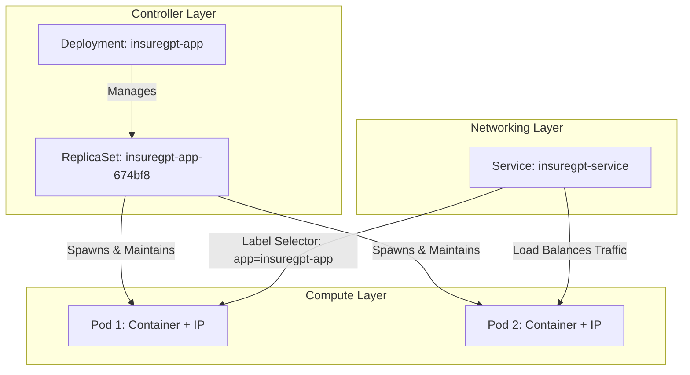

# KinD (Kubernetes in Docker) Deployment Guide — InsureGPT

Ye documentation aapko **InsureGPT** ko apne local machine par **KinD (Kubernetes in Docker)** cluster ke through step-by-step deploy karne ka complete guide provide karti hai.

---

## 📋 Table of Contents
1. [Prerequisites](#1-prerequisites)
2. [Folder Structure (Manifests)](#2-folder-structure-manifests)
3. [Core Kubernetes Architecture: Pod, ReplicaSet, Deployment & Service](#3-core-kubernetes-architecture-pod-replicaset-deployment--service)
4. [Step 1: KinD Cluster Create Karein (Port Mapping ke sath)](#step-1-kind-cluster-create-karein-port-mapping-ke-sath)
5. [Step 2: InsureGPT Docker Image Build Karein](#step-2-insuregpt-docker-image-build-karein)
6. [Step 3: Docker Image ko KinD Cluster me Load Karein](#step-3-docker-image-ko-kind-cluster-me-load-karein)
7. [Step 4: Kubernetes Secret me API Keys Configure Karein](#step-4-kubernetes-secret-me-api-keys-configure-karein)
8. [Step 5: Kubernetes Manifests Apply Karein](#step-5-kubernetes-manifests-apply-karein)
9. [Step 6: Pods & Service Status Verify Karein](#step-6-pods--service-status-verify-karein)
10. [Step 7: Application Access Karein](#step-7-application-access-karein)
11. [Useful Debugging & Management Commands](#useful-debugging--management-commands)
12. [Cluster Teardown (Clean Up)](#cluster-teardown-clean-up)

---

## 1. Prerequisites

Aapke local machine (Windows / macOS / Linux) par ye tools installed hone chahiye:

1. **Docker Desktop**: Running condition mein hona chahiye.
2. **KinD (Kubernetes in Docker)**:
   - *Windows (via Winget)*:
     ```powershell
     winget install Kubernetes.kind
     ```
   - *Windows (via Choco)*:
     ```powershell
     choco install kind
     ```
   - *Linux / macOS*:
     ```bash
     brew install kind
     ```
3. **kubectl**:
   - *Windows (via Winget)*:
     ```powershell
     winget install Kubernetes.kubectl
     ```

Versions verify karein:
```bash
docker --version
kind --version
kubectl version --client
```

---

## 2. Folder Structure (Manifests)

Project ke andar `k8s/` folder mein following production-ready manifests available hain:

```
INSUREGPT/
└── k8s/
    ├── kind-config.yaml       # KinD Cluster config (Host 8000 -> NodePort 30080)
    ├── 00-namespace.yaml      # Dedicated 'insuregpt' namespace
    ├── 01-configmap.yaml      # Application configuration (MySQL host, DB name, etc.)
    ├── 02-secret.yaml         # Sensitive credentials (API Keys & DB passwords)
    ├── 03-mysql.yaml          # MySQL 8.4 PVC, Deployment & ClusterIP Service
    └── 04-app.yaml            # InsureGPT Deployment (with InitContainer) & NodePort Service
```

---

## 3. Core Kubernetes Architecture: Pod, ReplicaSet, Deployment & Service

InsureGPT ko deploy karne se pehle in 4 core components ka aapas mein relation aur working samajhna zaroori hai:



### 1. 📦 Pod (Sabse Chhoti Deployable Unit)
* **Kya hai?**: Kubernetes ka sabse atomic block. Ek Pod ke andar **ek ya ek se zyada Docker containers** hote hain jo same network namespace (IP) aur volumes share karte hain.
* **Property**: Pods temporary (ephemeral) hote hain. Agar pod crash ho jaye, toh wo khud naya pod nahi bana sakta.
* **InsureGPT mein**:
  - `insuregpt-app-xxxxx-xxxxx`: Iske andar FastAPI app aur wait-for-mysql initContainer chalta hai.
  - `mysql-deployment-xxxxx-xxxxx`: Iske andar MySQL 8.4 database container chalta hai.

### 2. 🔁 ReplicaSet (Pod ki Sankhya Guarantee Karne Wala)
* **Kya hai?**: ReplicaSet ka kaam hota hai specify kiye gaye number of Pods (e.g. `replicas: 1` ya `2`) ko 24/7 zinda rakhna. Agar koi pod kill ho jaye, toh ye turant naya Pod launch karta hai (Self-Healing).
* **InsureGPT mein**: Jab hum deployment apply karte hain, toh background mein automatically ReplicaSet banta hai jo InsureGPT pod ko monitor karta hai.

### 3. 🚀 Deployment (Application Lifecycle Manager)
* **Kya hai?**: ReplicaSet ke upar ka higher-level controller jo handle karta hai:
  - **Zero-Downtime Rolling Updates**: Purane pods ko ek-ek karke band karke naye pods launch karna.
  - **Rollback**: Agar naye version me bug aaya toh purane version par wapas switch karna (`kubectl rollout undo`).
  - **Scaling**: Workload badhne par pods ki sankhya badhana (`kubectl scale deployment`).
* **InsureGPT mein**: `k8s/04-app.yaml` aur `k8s/03-mysql.yaml` dono **Deployments** hain.

### 4. 🌐 Service (Stable Networking & Load Balancer)
* **Kya hai?**: Pods ka IP address dynamic hota hai (har restart par badal jata hai). **Service** unke samne ek **Permanent Static IP / DNS Name** provide karti hai aur incoming requests ko Pods ke beech balance karti hai.
* **InsureGPT mein 2 Services hain**:
  1. **`mysql-service` (Type: ClusterIP)**: Cluster ke andar permanent DNS deta hai: `mysql-service:3306`.
  2. **`insuregpt-service` (Type: NodePort)**: Bahar ke traffic (Port 8000 / 30080) ko application pod tak forward karta hai.

### 📊 Quick Comparison Table

| Resource | Kaun Manage Karta Hai? | Mukhya Kaam (Primary Role) | InsureGPT Example |
| :--- | :--- | :--- | :--- |
| **Pod** | ReplicaSet | Actual container(s) run karna | `insuregpt-app-7b89...` |
| **ReplicaSet** | Deployment | Exact number of Pods maintain karna | Background auto-created |
| **Deployment** | Developer / YAML | Rolling updates, scaling, self-healing | `insuregpt-app` |
| **Service** | K8s Network Proxy | Stable IP, DNS & Load Balancing | `mysql-service`, `insuregpt-service` |

---

## Step 1: KinD Cluster Create Karein (Port Mapping ke sath)

Humne `k8s/kind-config.yaml` mein host port `8000` ko KinD container ke nodePort `30080` par forward kiya hai:


```bash
kind create cluster --config k8s/kind-config.yaml --name insuregpt-cluster
```

Cluster ready hone par verify karein:
```bash
kubectl cluster-info --context kind-insuregpt-cluster
kubectl get nodes
```

---

## Step 2: InsureGPT Docker Image Build Karein

Project ke root directory (`d:\INSUREGPT`) se Docker image build karein:

```bash
docker build -t insuregpt:latest .
```

Verify karein ki image successfully build ho gayi hai:
```bash
docker images | grep insuregpt
```

---

## Step 3: Docker Image ko KinD Cluster me Load Karein

> [!IMPORTANT]
> KinD cluster ek isolated Docker container ke andar chalta hai. Local image ko cluster nodes ke andar direct load karne ke liye `kind load` command chalana zaroori hota hai (bina kisi external Docker Hub registry ke push kiye):

```bash
kind load docker-image insuregpt:latest --name insuregpt-cluster
```

---

## Step 4: Kubernetes Secret me API Keys Configure Karein

File `k8s/02-secret.yaml` open karein aur apni actual API keys enter karein:

```yaml
apiVersion: v1
kind: Secret
metadata:
  name: insuregpt-secret
  namespace: insuregpt
type: Opaque
stringData:
  MYSQL_ROOT_PASSWORD: "root"
  MYSQL_PASSWORD: "root"
  GROQ_API_KEY: "gsk_your_actual_groq_key"
  PINECONE_API_KEY: "your_actual_pinecone_key"
  TAVILY_API_KEY: "tvly-your_actual_tavily_key"
```

---

## Step 5: Kubernetes Manifests Apply Karein

Sabhi manifests ko order mein ya single directory command se apply karein:

```bash
# Apply entire k8s folder
kubectl apply -f k8s/00-namespace.yaml
kubectl apply -f k8s/01-configmap.yaml
kubectl apply -f k8s/02-secret.yaml
kubectl apply -f k8s/03-mysql.yaml
kubectl apply -f k8s/04-app.yaml
```

*Ya fir directly poora folder ek sath:*
```bash
kubectl apply -f k8s/
```

---

## Step 6: Pods & Service Status Verify Karein

Deployment status watch karein:

```bash
kubectl get pods -n insuregpt -w
```

Expected Output:
```
NAME                                READY   STATUS     RESTARTS   AGE
mysql-deployment-xxxxxxxxxx-xxxxx   1/1     Running    0          45s
insuregpt-app-xxxxxxxxxx-xxxxx      1/1     Running    0          20s
```

> **Note**: `insuregpt-app` mein ek smart `initContainer` (`wait-for-mysql`) laga hai jo MySQL service ke port 3306 par completely ready hone tak wait karta hai, taaki app crash na ho.

Services check karein:
```bash
kubectl get svc -n insuregpt
```

---

## Step 7: Application Access Karein

### Option A: Direct Localhost (Port Mapping ke through)
Kyunki humne `kind-config.yaml` mein port 8000 map kiya hua hai:
- **Web Chat UI**: [http://localhost:8000](http://localhost:8000)
- **API Swagger Docs**: [http://localhost:8000/docs](http://localhost:8000/docs)
- **Health Check**: [http://localhost:8000/api/health](http://localhost:8000/api/health)

### Option B: Kubectl Port-Forward (Alternative)
Agar aap port-forwarding manually use karna chahte hain:
```bash
kubectl port-forward svc/insuregpt-service -n insuregpt 8000:8000
```

---

## Useful Debugging & Management Commands

### Application Logs dekhne ke liye:
```bash
kubectl logs -n insuregpt -l app=insuregpt-app -f
```

### MySQL Database Logs dekhne ke liye:
```bash
kubectl logs -n insuregpt -l app=mysql -f
```

### Pod ke andar interactive shell open karne ke liye:
```bash
kubectl exec -it -n insuregpt deployment/insuregpt-app -- /bin/bash
```

### MySQL ke andar login karne ke liye:
```bash
kubectl exec -it -n insuregpt deployment/mysql-deployment -- mysql -u root -proot insuregpt
```

---

## Cluster Teardown (Clean Up)

Jab aapka testing complete ho jaye, toh pura cluster delete karne ke liye:

```bash
kind delete cluster --name insuregpt-cluster
```
